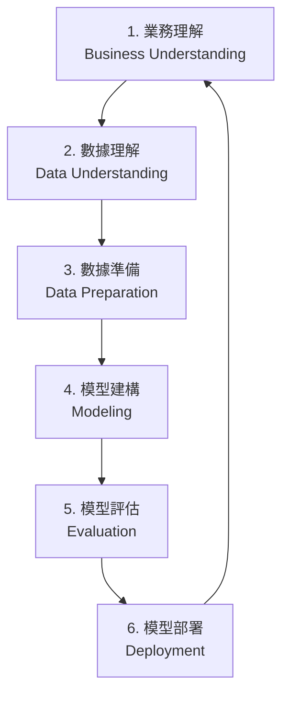

# 50 Startups 利潤預測與分析報告 (CRISP-DM 範例)

本報告基於 **CRISP-DM** (Cross-Industry Standard Process for Data Mining) 流程，使用位於 `D:\Mume\20260609-50starup\50_Startups.csv` 的數據集進行數據分析與機器學習建模。

---

## 📌 CRISP-DM 流程概述

---

## 1. 業務理解 (Business Understanding)

*   **商業背景**：創投機構 (VC) 與創業孵化器每天都需要評估大量新創團隊的商業計劃。了解資金在各部門的分配如何影響最終利潤，對於投資決策至關重要。
*   **分析目標**：
    1.  預測新創公司的 **淨利潤 (Profit)**。
    2.  量化 **研發支出 (R&D Spend)**、**行政管理費 (Administration)** 與 **行銷費用 (Marketing Spend)** 對利潤的邊際貢獻。
    3.  分析運營地區 (**State**) 是否對利潤有顯著影響。
*   **決策價值**：幫助新創團隊優化預算配置，並協助投資人進行數據驅動的投資組合篩選。

---

## 2. 數據理解 (Data Understanding)

數據集共包含 **50 家新創公司** 的觀測記錄，共有 5 個欄位：

### 欄位說明表
| 欄位名稱 | 數據類型 | 定義說明 |
| :--- | :--- | :--- |
| **R&D Spend** | 數值型 (Float) | 用於研究與開發的資金投入 |
| **Administration** | 數值型 (Float) | 用於日常行政與運營的資金投入 |
| **Marketing Spend** | 數值型 (Float) | 用於市場推廣與廣告宣傳的資金投入 |
| **State** | 類別型 (String) | 公司註冊運營所在的聯邦州 (California, New York, Florida) |
| **Profit** | 數值型 (Float) | **目標變數**：新創公司的年度淨利潤 |

### 🔍 數據探索與統計分析

#### (1) 基礎敘述性統計 (Summary Statistics)
*   **平均淨利潤**：約 **$112,012.64 美元**，變異範圍大（最低約 $14,681.40，最高達 $192,261.83）。
*   **研發支出**：平均約 $73,721.62 美元，部分公司研發投入為 0。
*   **行銷支出**：平均約 $211,025.10 美元，是所有支出中平均數值最大的一項。
*   **缺失值**：經檢查，所有欄位均無缺失值 (Missing Values)，數據質量良好。

#### (2) 相關性矩陣分析 (Correlation Matrix)
僅針對數值型欄位計算 Pearson 相關係數：

| 特徵 | R&D Spend | Administration | Marketing Spend | Profit (目標) |
| :--- | :---: | :---: | :---: | :---: |
| **R&D Spend** | 1.000 | 0.242 | 0.724 | **0.973** |
| **Administration** | 0.242 | 1.000 | -0.032 | **0.201** |
| **Marketing Spend** | 0.724 | -0.032 | 1.000 | **0.748** |
| **Profit** | **0.973** | **0.201** | **0.748** | 1.000 |

> 💡 **核心洞察**：
> *   **R&D Spend** 與 **Profit** 有著極高且顯著的正相關性 (**0.973**)。這意味著研發經費投入越多的新創公司，其淨利潤通常也越高。
> *   **Marketing Spend** 與利潤呈現中高度正相關 (**0.748**)，行銷對利潤增長有明顯的拉動作用。
> *   **Administration** 與利潤的相關性極低 (**0.201**)，說明行政開支的規模並不能直接反映或決定公司的盈利能力。

#### (3) 不同州別 (State) 的利潤表現
*   **California** (加州)：平均利潤 $103,905，共有 17 家。
*   **New York** (紐約州)：平均利潤 $113,756，共有 17 家。
*   **Florida** (佛羅里達州)：平均利潤 $118,774，共有 16 家。
*   佛羅里達州的平均利潤略高，但各州的樣本利潤分佈基本重疊，需要透過模型進一步量化其顯著性。

---

## 3. 數據準備 (Data Preparation)

為了使 Scikit-learn 模型能正確處理並公平評估所有特徵，我們執行了以下數據清洗與轉換步驟：

1.  **類別特徵編碼 (One-Hot Encoding)**：
    將 `State` 欄位進行獨熱編碼，轉換為 3 個獨立的虛擬變數：`State_California`, `State_Florida`, `State_New York`。這樣可以消除類別變數無序的特徵。
2.  **特徵縮放 (Feature Scaling)**：
    使用 `StandardScaler` 將三個連續變數 (`R&D Spend`, `Administration`, `Marketing Spend`) 標準化，轉換為均值為 0、標準差為 1 的分佈。這能保證如 Ridge 線性正則回歸或梯度提升等演算法不會因為特徵本身的數值級差而產生偏差。
3.  **數據分割 (Train-Test Split)**：
    將 50 筆數據以 **80:20** 的比例隨機分割。
    *   **訓練集 (Training Set)**：40 筆數據，用於模型的配適與訓練。
    *   **測試集 (Test Set)**：10 筆數據，作為未建模的獨立驗證集，用於客觀評估模型性能。

---

## 4. 模型建構 (Modeling)

我們選用了四種代表性的 Scikit-Learn 回歸模型，並配合 `GridSearchCV` 進行交叉驗證以尋找最佳超參數：

1.  **多元線性回歸 (Multiple Linear Regression)**：作為最基礎的回歸基準模型。
2.  **脊回歸 (Ridge Regression)**：加入了 L2 正則化懲罰項，防止特徵共線性導致的過度擬合。
3.  **隨機森林回歸 (Random Forest Regressor)**：集成學習決策樹模型，擅長捕捉特徵間的交互非線性關係。
4.  **梯度提升回歸 (Gradient Boosting Regressor)**：序列化決策樹加權模型，具有極強的擬合性能。

---

## 5. 模型評估 (Evaluation)

我們使用測試集 (Test Set) 對訓練好的模型進行泛化能力評估，評估指標包括：
*   **$R^2$ (決定係數)**：模型能解釋目標變數變異度的比例（越高越好，上限為 1.0）。
*   **MAE (平均絕對誤差)**：預測值與真實值之間的平均絕對差（越低越好，單位為美元）。
*   **RMSE (均方根誤差)**：對大誤差有更重懲罰的預測誤差標準差（越低越好，單位為美元）。

### 模型評估結果對比表
| 評估模型 | $R^2$ 得分 | 平均絕對誤差 (MAE) | 均方根誤差 (RMSE) |
| :--- | :---: | :---: | :---: |
| 🏆 **Gradient Boosting Regressor** | **0.9354** | **$4,986.88** | **$7,234.09** |
| 隨機森林回歸 (Random Forest) | 0.9264 | $5,720.59 | $7,718.48 |
| 多元線性回歸 (Linear Regression) | 0.8987 | $6,961.48 | $9,055.96 |
| 脊回歸 (Ridge Regression) | 0.8985 | $6,981.72 | $9,064.07 |

### 📊 特徵影響力分析 (Feature Importance)
從表現最佳的 **梯度提升回歸模型** 中提取特徵重要性：

*   **研發支出 (R&D Spend)**：影響權重高達 **93.80%**。這意味著新創公司的利潤幾乎完全由其在研發上的投入所決定。
*   **行銷費用 (Marketing Spend)**：影響權重為 **5.05%**。行銷支出為次要影響因素。
*   **行政管理費 (Administration)**：影響權重僅 **0.59%**。
*   **地區因素 (State)**：加州、佛州、紐約州三個虛擬變數的權重總和低於 **0.56%**。這表明公司註冊在哪個州別，對其年度利潤沒有實質的影響。

---

## 6. 模型部署與業務建議 (Deployment & Recommendations)

### 🚀 模型部署
模型已經成功打包為一個端到端的 Scikit-Learn Pipeline (`preprocessor` + `regressor`)，並持久化保存至 `best_model.pkl`。
目前本項目的互動式預測 Web 應用已在本地部署：
*   **啟動指令**：`streamlit run app.py --server.port 9000`
*   **訪問網址**：[http://127.0.0.1:9000](http://127.0.0.1:9000)

### 💡 商業決策建議
依據上述分析，我們為投資機構和企業創辦人提供以下決策方向：

1.  **「研發立足」戰略**：
    研發投入是提升利潤的關鍵核心。在資源有限的情況下，應當將最大比例的預算向研發團隊與產品打磨傾斜。
2.  **科學的行銷增量**：
    雖然行銷支出與利潤成正比，但其影響力遠小於研發。行銷應作為產品研發成熟後的放大器，而不應在早期本末倒置。
3.  **精簡行政支出**：
    行政和內部營運費用無法直接轉化為利潤增長。創始人應儘可能維持行政扁平化，控制非必要固定開支。
4.  **忽視州別稅收/補貼的利潤幻想**：
    分析證明在加利福尼亞、紐約或佛羅里達運營，利潤並不存在顯著的系統性差異。企業在選址時應主要考量人才密度或供應鏈便利度，而非單純的地區利潤預期。
